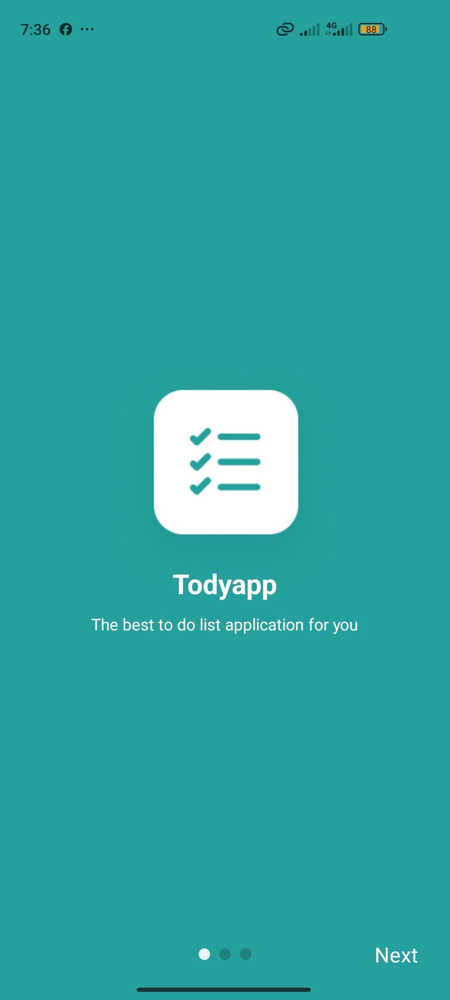
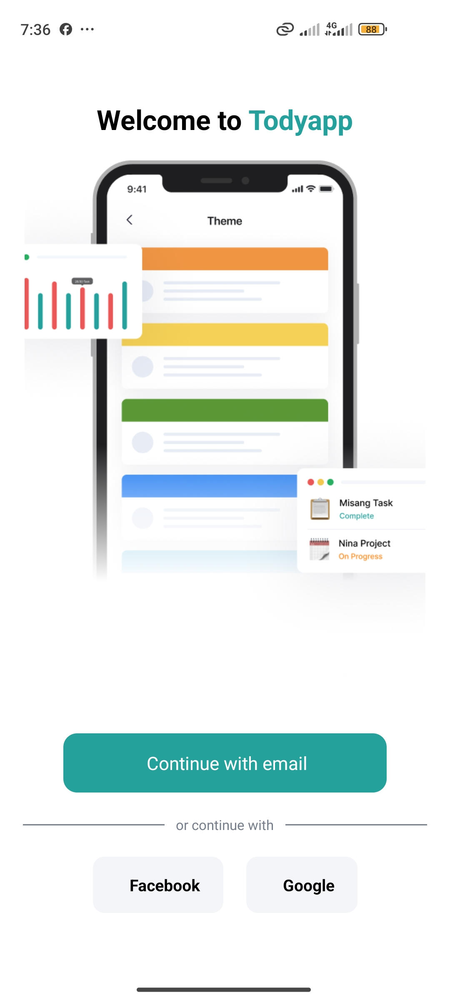
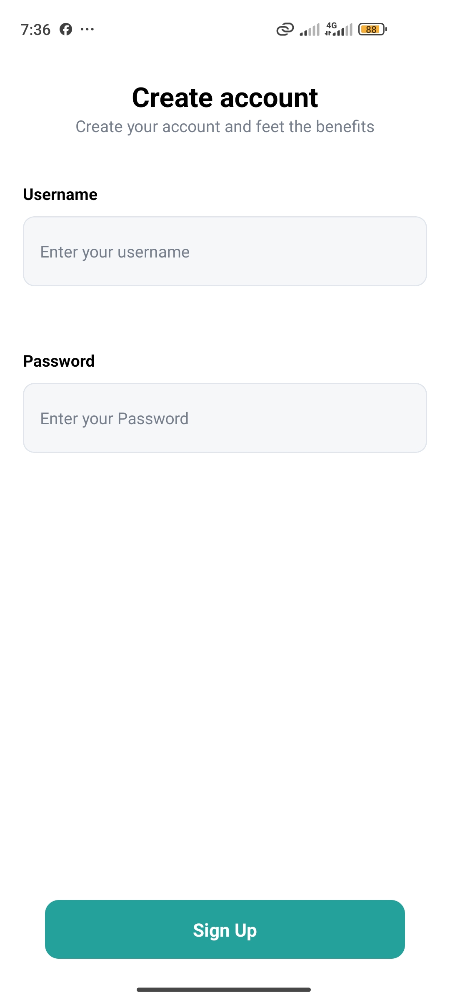
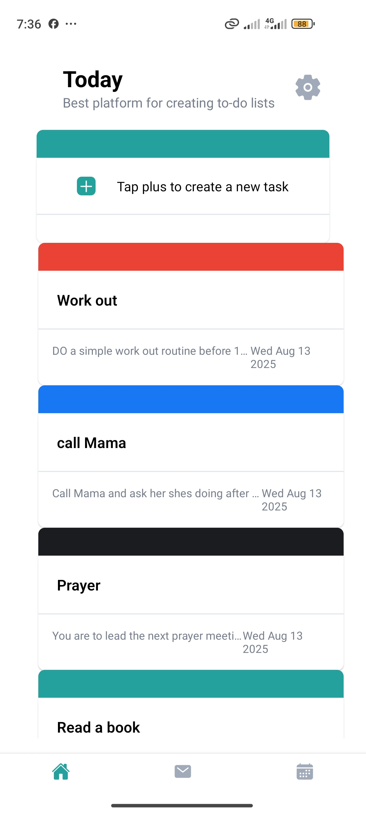
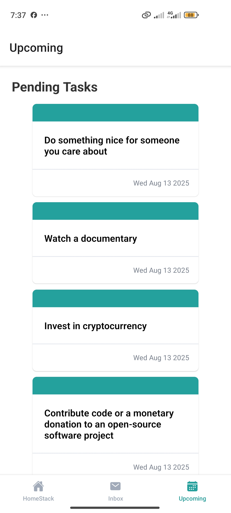
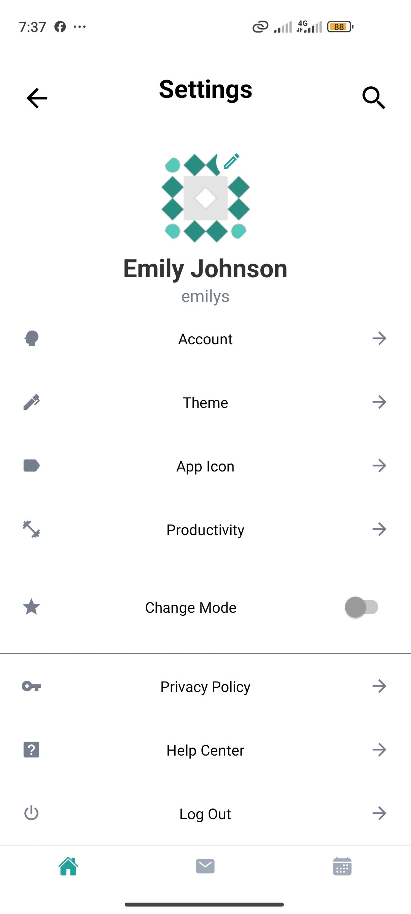

# P2Vest React Native Test – Todo App

A React Native Todo List application built as part of the P2Vest developer assessment.

---

## 📱 Features Implemented

- **Authentication**
  - Login with DummyJSON `/auth/login` endpoint.
  - Sign-up flow simulated locally (no backend endpoint available).
  - Auth state stored and managed with React Context + AsyncStorage.
  - User profile persisted and used across the app without extra API calls.
- **Homepage**
  - "Create Task" prompt card.
  - Static task list display with priority color coding.
- **Upcoming Tasks**

  - Integrated with DummyJSON `/todos` endpoint.
  - Tasks split into **Pending** and **Completed** tabs.
  - Toggle task completion with a single tap (updates locally and via API).

- **Settings**

  - Displays authenticated user's profile image, name, and email (from DummyJSON).
  - Static list of other settings options.
  - Logout functionality integrated with Auth Context.

- **Navigation**
  - Implemented with React Navigation Stack and Tab Navigators.
  - Separate flows for authentication and main app.

---

## 🛠 Technologies Used

- React Native
- TypeScript
- React Navigation
- React Context API
- AsyncStorage
- DummyJSON API (Auth, Users, Todos)

---

## 🎨 Design Choices

- **React Context over external state management**  
  The app's scale didn’t justify Redux or Zustand. Context provided a simple and effective way to share auth state and user data without extra dependencies.
- **Minimal API calls**  
  User profile data is fetched once at login and stored in context + AsyncStorage to avoid unnecessary network requests.

- **Component Reusability**  
  Components like `TodoCard` are reused for both the "create task" prompt and actual task listing, with props controlling layout and behavior.

- **Pragmatic styling**  
  Focused on matching the provided Figma layout closely but prioritized functionality and speed of development given time constraints.

---

## 🚧 Challenges Faced

- **Time constraints**: I only started the project a day before I believed the deadline to be (later discovered the real deadline had already passed), which required prioritizing core functionality over pixel-perfect UI.
- **Ambiguity in Figma flow**: Some screens (theme selection, calendar, clock) were omitted to meet time constraints and focus on required test functionality.
- **API mismatch**: The DummyJSON login endpoint requires `username`/`password`, while the Figma login screen showed only an email field — this required adapting the flow.
- **State persistence**: Decided between re-fetching user data in Settings or persisting it from login; went with persistence for simplicity and performance.

---

## 📂 How to Run

1. Clone the repository:

   ```bash
   git clone [text](https://github.com/noelams/p2vest-todo.git)
   cd p2vest-todo

   ```

2. Install dependencies:
   ```bash
   npm install
   # or
   yarn install
   ```

3 Start the metro Bundler:

```bash
npx expo start
```

4 Run on a device:

    Install the Expo Go app from the App Store or Google Play.

    Scan the QR code generated in your terminal or browser after running npx expo start.

## Screenshots







